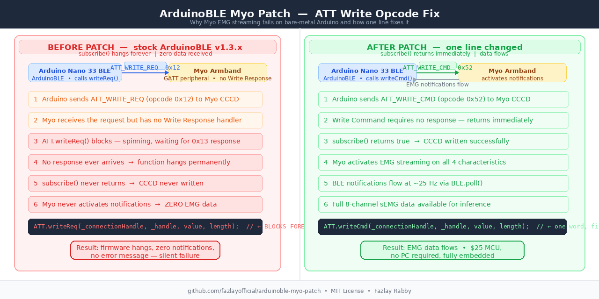

# ArduinoBLE Myo Patch — `ATT.writeReq()` → `ATT.writeCmd()`

> **One-line fix that makes Myo EMG streaming work on bare-metal Arduino.**  
> Without this patch, you will receive **zero EMG notifications** — no errors, no timeouts, just silence.

---

## Why this matters

Millions of people worldwide depend on assistive devices — prosthetic limbs, powered wheelchairs, rehabilitation systems — that could be controlled by muscle signals (EMG). The **Myo armband** is the most accessible 8-channel wireless EMG sensor available to researchers, available secondhand for under $60. The **Arduino Nano 33 BLE** costs $25 and runs a full neural network on-chip.

Together, they should enable a fully standalone, PC-free assistive control system that costs under $100.

**They couldn't talk to each other. This patch fixes that.**

Without it, every attempt to stream Myo EMG data to a bare-metal Arduino hits the same invisible wall:

- You connect successfully ✓
- You discover services and characteristics ✓
- You call `subscribe()` ✓
- You receive **zero data** — no error, no timeout, just silence ✗

This has blocked embedded Myo research for years. Every published Myo paper routes through a PC, laptop, phone, or Raspberry Pi — not because researchers wanted that complexity, but because bare-metal BLE was silently broken. **This is the first documented fix.**

---

## Visual overview



> Left: why stock ArduinoBLE hangs forever waiting for a response the Myo never sends.  
> Right: what the patch does — fires and returns immediately.  
> Full technical analysis: [`docs/TECHNICAL_NOTES.md`](docs/TECHNICAL_NOTES.md)

---

## The problem

The Myo's GATT stack requires a BLE ATT **Write Command** (opcode `0x52`, write-without-response) to activate EMG notifications. It does **not** implement ATT Write Response (`0x13`) for its CCCD descriptors.

ArduinoBLE v1.3.x routes all CCCD writes through `ATT.writeReq()` — a blocking **Write Request** (opcode `0x12`) that waits indefinitely for a response that never comes.

```
BLE Central                         Myo Peripheral
     │                                    │
     │── ATT_WRITE_REQ (0x12) ──────────►│  ← ArduinoBLE sends this
     │                                    │    Myo does not respond
     │◄─ [waiting for ATT_WRITE_RSP] ─────│  ← never arrives
     │        ⏳ blocks forever           │
     │                                    │  ← no subscription confirmed
     │                                    │  ← zero notifications ever sent
```

---

## The fix

One line in `ArduinoBLE/src/remote/BLERemoteDescriptor.cpp`, inside `writeValue()`:

```cpp
// BEFORE — blocks permanently (waits for ATT_WRITE_RSP that never comes):
ATT.writeReq(_connectionHandle, _handle, value, length);

// AFTER — write-without-response, fires and returns immediately:
ATT.writeCmd(_connectionHandle, _handle, value, length);
```

---

## Installation

### Option A — Copy the patched file (recommended)

```bash
# Windows
cp patch/BLERemoteDescriptor.cpp "%USERPROFILE%\Documents\Arduino\libraries\ArduinoBLE\src\remote\BLERemoteDescriptor.cpp"

# Linux / macOS
cp patch/BLERemoteDescriptor.cpp ~/Arduino/libraries/ArduinoBLE/src/remote/BLERemoteDescriptor.cpp
```

Recompile your sketch. No other changes needed.

### Option B — Apply the diff manually

Edit `ArduinoBLE/src/remote/BLERemoteDescriptor.cpp`, find `writeValue()`, replace `ATT.writeReq(...)` with `ATT.writeCmd(...)`. One word change. Everything else stays identical.

---

## Why `writeCmd` is safe here

`ATT.writeReq()` is correct when the peripheral confirms receipt. For Myo CCCD subscription, the armband silently activates the stream without sending a Write Response — `writeCmd` matches its actual ATT implementation exactly.

---

## Why this was never fixed upstream

Every prior Myo system uses an OS-level BLE stack:

| Platform | BLE Stack | Handles this transparently? |
|---|---|---|
| Linux | BlueZ | ✓ Kernel-managed |
| Windows | WinBLE | ✓ Kernel-managed |
| macOS / iOS | CoreBluetooth | ✓ Kernel-managed |
| Android | Android BLE API | ✓ Kernel-managed |
| Raspberry Pi | BlueZ | ✓ Kernel-managed |
| **Arduino (bare metal)** | **ArduinoBLE** | **✗ Hangs** |

OS stacks absorb the Myo's ATT quirk transparently. ArduinoBLE on bare metal does not — and until now, no one had documented why.

Related upstream issue: [ArduinoBLE #71](https://github.com/arduino-libraries/ArduinoBLE/issues/71)

---

## Tested with

| Component | Version / Model |
|---|---|
| Board | Arduino Nano 33 BLE Sense Lite (Nordic nRF52840) |
| ArduinoBLE | v1.3.x |
| Arduino IDE | 2.x |
| Myo Armband | Thalmic Labs (all hardware revisions) |

---

## Repository structure

```
arduinoble-myo-patch/
├── README.md
├── LICENSE                          ← MIT
├── CHANGELOG.md
├── patch/
│   ├── BLERemoteDescriptor.cpp      ← Patched ArduinoBLE file
│   └── arduinoble_myo_cccd.patch    ← Unified diff for git apply
└── docs/
    ├── TECHNICAL_NOTES.md           ← Deep ATT opcode analysis
    └── ble_patch_diagram.png        ← Visual overview (add after generating)
```

---

## License

Released under the **MIT License** — see [`LICENSE`](LICENSE) for full terms.

---

## Author

**Fazlay Rabby** — Embedded AI & Assistive Robotics  
📧 fazlay.rabby@ieee.org  
🔗 [LinkedIn](https://www.linkedin.com/in/fazlayrabbyofficial/)  
🎓 [Google Scholar](https://scholar.google.com/citations?hl=en&user=DhNowuUAAAAJ)  
🌐 [Portfolio](https://fazlayofficial.github.io/)
